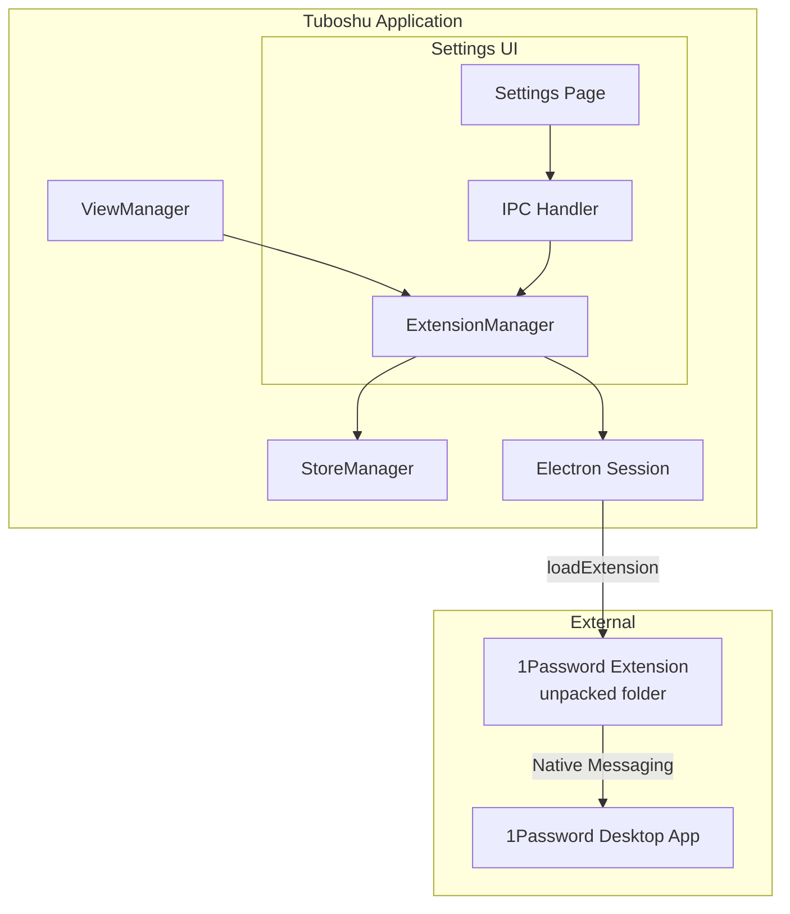

# Design Document: 1Password Extension Support

## Overview

本设计文档描述了为 Tuboshu 桌面应用添加 1Password 浏览器扩展支持的技术方案。该功能允许用户加载本地安装的 1Password Chrome 扩展，实现密码自动填充功能。

### 设计目标

1. 支持加载用户本地的 1Password Chrome 扩展（unpacked 格式）
2. 支持 Native Messaging，使扩展能与 1Password 桌面应用通信
3. 提供配置界面让用户管理扩展设置
4. 确保扩展加载失败不影响应用正常运行

### 技术约束

- Electron 36.0 仅支持加载 unpacked 扩展（不支持 .crx 文件）
- 扩展需要在 session 级别加载，每个 partition 独立
- Native Messaging 需要 1Password 桌面应用已安装并配置

## Architecture



### 组件职责

| 组件 | 职责 |
|------|------|
| ExtensionManager | 管理扩展加载、验证、状态管理 |
| StoreManager | 持久化扩展配置（路径、启用状态） |
| ViewManager | 在创建视图时触发扩展加载 |
| Settings UI | 提供用户配置界面 |

## Components and Interfaces

### 1. ExtensionManager 模块

新建 `app/extension/extensionManager.js` 模块，负责 1Password 扩展的加载和管理。

```javascript
// app/extension/extensionManager.js
class ExtensionManager {
    constructor() {
        this.loadedSessions = new Set(); // 记录已加载扩展的 session
    }

    /**
     * 验证扩展路径是否有效
     * @param {string} extensionPath - 扩展目录路径
     * @returns {Promise<{valid: boolean, error?: string}>}
     */
    async validateExtensionPath(extensionPath) {}

    /**
     * 为指定 session 加载 1Password 扩展
     * @param {Session} session - Electron session 对象
     * @returns {Promise<{success: boolean, error?: string}>}
     */
    async load1PasswordExtension(session) {}

    /**
     * 检查 session 是否已加载扩展
     * @param {string} partitionName - session partition 名称
     * @returns {boolean}
     */
    isExtensionLoaded(partitionName) {}

    /**
     * 获取扩展配置
     * @returns {{enabled: boolean, path: string}}
     */
    getConfig() {}

    /**
     * 更新扩展配置
     * @param {{enabled?: boolean, path?: string}} config
     * @returns {Promise<{success: boolean, error?: string}>}
     */
    async updateConfig(config) {}
}
```

### 2. StoreManager 配置扩展

在 `app/constants.js` 中添加 1Password 扩展相关配置项：

```javascript
// 新增配置项
CONFIG: {
    // ... 现有配置
    is1PasswordEnabled: 0,           // 是否启用 1Password 扩展
    onePasswordExtensionPath: '',    // 1Password 扩展路径
}
```

### 3. IPC 通信接口

在主进程中注册 IPC 处理器，供设置界面调用：

```javascript
// IPC 通道定义
const IPC_CHANNELS = {
    GET_1PASSWORD_CONFIG: '1password:get-config',
    SET_1PASSWORD_CONFIG: '1password:set-config',
    VALIDATE_EXTENSION_PATH: '1password:validate-path',
    SELECT_EXTENSION_FOLDER: '1password:select-folder'
};
```

### 4. ViewManager 集成

修改 `viewManager.js` 中的 `createView` 方法，在加载内置扩展后加载 1Password 扩展：

```javascript
// 在 createView 方法中
if (isHttpAddr) {
    Utility.alterRequestHeader(view, headers);
    Utility.alterResponseHeader(view);
    Utility.loadExtensions(view).finally();
    
    // 加载 1Password 扩展
    await extensionManager.load1PasswordExtension(view.webContents.session);
}
```

## Data Models

### 扩展配置数据模型

```typescript
interface OnePasswordConfig {
    enabled: boolean;      // 是否启用
    path: string;          // 扩展目录路径
}

interface ExtensionValidationResult {
    valid: boolean;        // 路径是否有效
    error?: string;        // 错误信息
    manifestVersion?: number;  // manifest 版本
    extensionName?: string;    // 扩展名称
}

interface ExtensionLoadResult {
    success: boolean;      // 加载是否成功
    error?: string;        // 错误信息
    extensionId?: string;  // 扩展 ID
}
```

### 1Password 扩展路径参考

用户需要找到本地 Chrome 中已安装的 1Password 扩展目录：

| 操作系统 | 默认路径 |
|---------|---------|
| Windows | `C:\Users\[用户名]\AppData\Local\Google\Chrome\User Data\Default\Extensions\aeblfdkhhhdcdjpifhhbdiojplfjncoa\[版本号]` |
| macOS | `~/Library/Application Support/Google/Chrome/Default/Extensions/aeblfdkhhhdcdjpifhhbdiojplfjncoa/[版本号]` |
| Linux | `~/.config/google-chrome/Default/Extensions/aeblfdkhhhdcdjpifhhbdiojplfjncoa/[版本号]` |

注：`aeblfdkhhhdcdjpifhhbdiojplfjncoa` 是 1Password 扩展的 Chrome Web Store ID。


## Correctness Properties

*A property is a characteristic or behavior that should hold true across all valid executions of a system—essentially, a formal statement about what the system should do. Properties serve as the bridge between human-readable specifications and machine-verifiable correctness guarantees.*

### Property 1: Configuration Round-Trip

*For any* valid configuration object containing `enabled` (boolean) and `path` (string), storing the configuration and then retrieving it SHALL return an equivalent configuration object.

**Validates: Requirements 1.1, 4.1**

### Property 2: Path Validation Correctness

*For any* file system path, the validation function SHALL return `valid: true` if and only if the path exists and contains a valid Chrome extension manifest.json file with required fields (`name`, `version`, `manifest_version`).

**Validates: Requirements 1.2, 1.3**

### Property 3: Extension Loading Idempotence

*For any* session partition, calling `load1PasswordExtension` multiple times SHALL result in the extension being loaded exactly once, and subsequent calls SHALL return success without re-loading.

**Validates: Requirements 2.4**

### Property 4: Conditional Loading Based on Config

*For any* combination of `enabled` state and `path` validity:
- If `enabled` is false, the extension SHALL NOT be loaded regardless of path validity
- If `enabled` is true and path is invalid, the extension SHALL NOT be loaded
- If `enabled` is true and path is valid, the extension SHALL be loaded

**Validates: Requirements 2.1, 4.2, 4.3**

### Property 5: Error Resilience

*For any* error condition during extension loading (invalid path, corrupted manifest, Electron API failure), the ExtensionManager SHALL catch the error, log it, and return a failure result without throwing an exception.

**Validates: Requirements 2.3, 6.3**

## Error Handling

### 错误类型与处理策略

| 错误类型 | 处理策略 | 用户反馈 |
|---------|---------|---------|
| 路径不存在 | 返回验证失败 | 显示"指定路径不存在" |
| manifest.json 缺失 | 返回验证失败 | 显示"未找到有效的扩展清单文件" |
| manifest.json 格式错误 | 返回验证失败 | 显示"扩展清单文件格式无效" |
| Electron 加载失败 | 记录日志，继续运行 | 控制台警告 |
| Native Messaging 不可用 | 记录日志，继续运行 | 控制台警告 |

### 错误处理代码模式

```javascript
async load1PasswordExtension(session) {
    try {
        const config = this.getConfig();
        
        // 检查是否启用
        if (!config.enabled) {
            return { success: true, skipped: true, reason: 'disabled' };
        }
        
        // 验证路径
        const validation = await this.validateExtensionPath(config.path);
        if (!validation.valid) {
            console.warn(`[1Password] Invalid extension path: ${validation.error}`);
            return { success: false, error: validation.error };
        }
        
        // 检查是否已加载
        const partitionKey = session.getStoragePath?.() || 'default';
        if (this.loadedSessions.has(partitionKey)) {
            return { success: true, skipped: true, reason: 'already_loaded' };
        }
        
        // 加载扩展
        const extension = await session.extensions.loadExtension(config.path, {
            allowFileAccess: true
        });
        
        this.loadedSessions.add(partitionKey);
        console.log(`[1Password] Extension loaded: ${extension.name} (${extension.id})`);
        
        return { success: true, extensionId: extension.id };
        
    } catch (error) {
        console.error(`[1Password] Failed to load extension:`, error);
        return { success: false, error: error.message };
    }
}
```

## Testing Strategy

### 测试方法

本功能采用双重测试策略：

1. **单元测试 (Unit Tests)**: 验证具体示例、边界情况和错误条件
2. **属性测试 (Property-Based Tests)**: 验证跨所有输入的通用属性

### 属性测试配置

- 测试框架: `fast-check` (JavaScript 属性测试库)
- 每个属性测试最少运行 100 次迭代
- 每个测试需标注对应的设计文档属性

### 测试标注格式

```javascript
// Feature: 1password-extension-support, Property 1: Configuration Round-Trip
test.prop([fc.boolean(), fc.string()], (enabled, path) => {
    // 测试实现
});
```

### 测试覆盖范围

| 属性 | 测试类型 | 覆盖需求 |
|-----|---------|---------|
| Property 1 | 属性测试 | 1.1, 4.1 |
| Property 2 | 属性测试 + 单元测试 | 1.2, 1.3 |
| Property 3 | 属性测试 | 2.4 |
| Property 4 | 属性测试 | 2.1, 4.2, 4.3 |
| Property 5 | 属性测试 | 2.3, 6.3 |

### 单元测试示例

```javascript
describe('ExtensionManager', () => {
    describe('validateExtensionPath', () => {
        it('should return valid for path with valid manifest', async () => {
            // 具体示例测试
        });
        
        it('should return invalid for non-existent path', async () => {
            // 边界情况测试
        });
        
        it('should return invalid for path without manifest.json', async () => {
            // 错误条件测试
        });
    });
});
```

### 集成测试

由于涉及 Electron API 和文件系统，部分测试需要在 Electron 环境中运行：

1. 扩展加载集成测试
2. IPC 通信测试
3. 设置界面 E2E 测试（可选）
